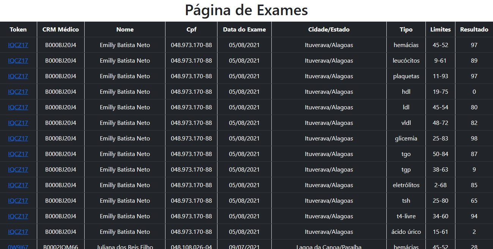

# Rebase Labs

Uma app web para listagem de exames médicos desenvolvida para acompanhar os encontros de Laboratório da Rebase com o Treinadev. 

[Documento com as orientações para elaborar o projeto](instrucoes.md).

## Tech Stack

* Docker
* Ruby
* Javascript
* HTML
* CSS

## Passo a passo para rodar a app

<p align = "justify"> Clone o projeto: </p>

```
 git@github.com:Thalis-Freitas/rebase-labs.git
```

<p align = "justify"> Entre na pasta do projeto: </p>

```
 cd rebase-labs
```

<p align = "justify"> Suba o servidor: </p>

```
 docker compose up -d
```

<p align = "justify"> Importe os dados do csv para a base de dados: </p>

```
 docker compose exec app ruby import_from_csv.rb
```

* Acesse http://localhost:3000/

<p align = "justify"> Comando para rodar os testes: </p>

```
 docker compose exec app rspec
```

<p align = "justify"> Comando para derrubar a app: </p>

```
 docker compose down
```

## Endpoints

#### GET /

Exibe todos os exames em uma tabela



#### GET /api/exams

Retorna todos os exames do banco em formato json

```json

[
   {
   "id":"1",
   "taxpayer_registry":"048.973.170-88",
   "name":"Emilly Batista Neto",
   "email":"gerald.crona@ebert-quigley.com",
   "birth_date":"2001-03-11",
   "address":"165 Rua Rafaela",
   "city":"Ituverava",
   "state":"Alagoas",
   "medical_crm":"B000BJ20J4",
   "medical_crm_state":"PI",
   "medical_name":"Maria Luiza Pires",
   "medical_email":"denna@wisozk.biz",
   "token":"IQCZ17",
   "exam_date":"2021-08-05",
   "type_of_exam":"hemácias",
   "limits":"45-52","result":"97"
   },
   {
   "id":"2",
   "taxpayer_registry":"048.973.170-88",
   "name":"Emilly Batista Neto",
   "email":"gerald.crona@ebert-quigley.com",
   "birth_date":"2001-03-11",
   "address":"165 Rua Rafaela",
   "city":"Ituverava",
   "state":"Alagoas",
   "medical_crm":"B000BJ20J4",
   "medical_crm_state":"PI",
   "medical_name":"Maria Luiza Pires",
   "medical_email":"denna@wisozk.biz",
   "token":"IQCZ17",
   "exam_date":"2021-08-05",
   "type_of_exam":"leucócitos",
   "limits":"9-61",
   "result":"89"
   }
]

```

#### GET /:token

Exibe as informações dos exames que possuem o token passado como parâmetro


#### GET /api/exams/:token

Retorna os exames que possuem o token passado pela url em formato json

Exemplo com token `IQCZ17`

```json

[
  {
   "id":"1",
   "taxpayer_registry":"048.973.170-88",
   "name":"Emilly Batista Neto",
   "email":"gerald.crona@ebert-quigley.com",
   "birth_date":"2001-03-11",
   "address":"165 Rua Rafaela",
   "city":"Ituverava",
   "state":"Alagoas",
   "medical_crm":"B000BJ20J4",
   "medical_crm_state":"PI",
   "medical_name":"Maria Luiza Pires",
   "medical_email":"denna@wisozk.biz",
   "token":"IQCZ17",
   "exam_date":"2021-08-05",
   "type_of_exam":"hemácias",
   "limits":"45-52",
   "result":"97"
   },
   {
   "id":"2",
   "taxpayer_registry":"048.973.170-88",
   "name":"Emilly Batista Neto",
   "email":"gerald.crona@ebert-quigley.com",
   "birth_date":"2001-03-11",
   "address":"165 Rua Rafaela",
   "city":"Ituverava",
   "state":"Alagoas",
   "medical_crm":"B000BJ20J4",
   "medical_crm_state":"PI",
   "medical_name":"Maria Luiza Pires",
   "medical_email":"denna@wisozk.biz",
   "token":"IQCZ17",
   "exam_date":"2021-08-05",
   "type_of_exam":"leucócitos",
   "limits":"9-61",
   "result":"89"
   }
]

```

#### POST /import

Permite importar os dados de um arquivo .csv para a base de dados

Parâmetros a serem enviados:

```csv
cpf;nome paciente;email paciente;data nascimento paciente;endereço/rua paciente;cidade paciente;estado paciente;crm médico;crm médico estado;nome médico;email médico;token resultado exame;data exame;tipo exame;limites tipo exame;resultado tipo exame
048.973.170-88;Emilly Batista Neto;gerald.crona@ebert-quigley.com;2001-03-11;165 Rua Rafaela;Ituverava;Alagoas;B000BJ20J4;PI;Maria Luiza Pires;denna@wisozk.biz;IQCZ17;2021-08-05;hemácias;45-52;97
076.278.738-43;Víctor Limeira;tad_smitham@kerluke-smitham.name;1963-12-16;968 Viela Maria Vitória;Buritis;Mato Grosso;B000BJ20J4;PI;Maria Luiza Pires;denna@wisozk.biz;IN33R0;2021-07-21;eletrólitos;2-68;98
```
